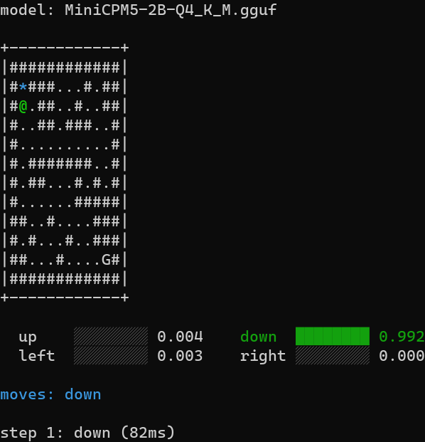

# minicpm_jev_like

基于 MiniCPM5-2B (GGUF) 的**快速决策引擎**（思路来自 JEV / TypeSafe）：模型不写自由文本，只在给定的候选项里选，并给出每个候选的概率。支持三种问法——是/否判断 `noul`、多选一 `choice`、给档位打分 `score`。请求格式和错误码与官方的 `POST /v1/systemone` 一致，CPU 和 GPU 都能跑。



上图为 `examples/maze_walk.py` 在终端里的实况录屏（12×12 迷宫，随机种子 42，走了 18 步到达最短路径）。动画里每一步停顿多久，就是本机实测一次决策要多久。

## 运行环境

- Python 3.11（Windows 和 Linux 都可以）；
- 只用 CPU 也能跑；想快就配 NVIDIA 显卡和 CUDA 12.x；
- 2B 的 Q4_K_M 量化版本全部放进显存约占 3GB；8GB 显存的机器可以把上下文长度 `n_ctx` 开到 32k；
- 模型权重每个约 1.5GB，不放在代码仓库里，用下面的脚本自己下载。

## 环境安装

```powershell
python -m venv .venv
.venv\Scripts\python.exe -m pip install -U pip
.venv\Scripts\python.exe -m pip install -r requirements.txt
```

PyPI 上默认装到的 `llama-cpp-python` 预编译包一般是 CPU 版，装完把配置文件 `config.json` 里的 `device` 改成 `cpu` 就能启动。想用 GPU 加速，就跑 `bash scripts/build_llama_cuda.sh` 从源码编译（需要先装好 Visual Studio 2022、CUDA Toolkit、CMake 和 Ninja），编译出来的文件会自动放到 `llama_cpp/lib/` 下面。

## 下载模型权重

```powershell
.venv\Scripts\python.exe scripts\download_model.py --quant list
.venv\Scripts\python.exe scripts\download_model.py --quant Q4_K_M --parts 12
```

模型默认下载到 `weights/` 目录（已在 `.gitignore` 里排除，不会入库）。加参数 `--source abliterated` 下载的是去掉安全限制的对照版本。

## 启动服务

```powershell
.venv\Scripts\python.exe -m minicpm_jev.service
```

服务启动时默认读仓库根目录下的 `config.json`；也可以用命令行参数临时覆盖其中几项：

```powershell
.venv\Scripts\python.exe -m minicpm_jev.service --device cpu --n-ctx 8192
```

主要配置项如下（全部参数见 `config.json`）：

| 配置项 | 默认值 | 说明 |
| --- | --- | --- |
| `host` / `port` | `127.0.0.1` / `8000` | 服务监听地址 |
| `api_key` | `null` | 留空就不验密钥；填了的话请求必须带 `Authorization: Bearer <key>` |
| `model_path` | `weights/MiniCPM5-2B-Q4_K_M.gguf` | 默认加载哪个模型文件 |
| `model_aliases` | `{}` | 请求里写的模型名 → 本地文件名的对照表 |
| `device` | `gpu` | 用 `gpu` 还是 `cpu`（选 cpu 时会屏蔽 CUDA 设备，否则数值不稳定） |
| `n_ctx` | `32768` | 上下文长度（最大 131072，超了启动就直接报错，不会偷偷改小） |
| `chunk_size` | `128` | `choice` 一次算多少个候选，超出就分批（可填 1~128） |
| `n_seq_max` | `16` | 一批里最多同时算多少条不重复的序列 |
| `queue_max` | `30` | 最多排队等多少个请求，排满了返回 429 |

## 接口调用示例

```powershell
curl.exe -s http://127.0.0.1:8000/v1/systemone -H "Content-Type: application/json" -d "{\"state\":\"Invoice #4471 issued March 3, 2026 for $12,840.00, net 30.\",\"model\":\"MiniCPM5-2B-Q4_K_M\",\"questions\":{\"amount_due\":{\"type\":\"score\",\"instructions\":{\"field\":{\"name\":\"amount_due\",\"type\":\"number\",\"unit\":\"USD\",\"description\":\"The total the invoice asks to be paid.\"},\"question\":\"How large is the field value?\"},\"criteria\":[\"Under $1,000\",\"$1,000 to $10,000\",\"$10,000 to $100,000\"]}}}"
```

一次可以问多个问题，全写在 `questions` 里，`state` 是它们共用的背景信息。完整的请求和返回长什么样，看 `examples/systemone_http.py`。

## Web 决策台

`web/` 是在浏览器里用的调试台，和后端是两个独立进程：它只通过 HTTP 调用 `/v1/systemone`，后端不需要为它写任何代码，换一种语言实现的后端也照样能连。

```powershell
cd web
npm install
npm run dev          # http://127.0.0.1:5273，页面上发的 /v1/* 请求会转给后端
```

构建出静态文件后，用一个不带任何第三方依赖的 Node 进程来托管（只用 Node 自带的标准库）：

```powershell
npm run build        # 产物落在 web/dist/
node web/server.mjs  # 托管静态文件，并把 /v1/* 转给后端
```

| 环境变量 | 默认值 | 说明 |
| --- | --- | --- |
| `WEB_HOST` / `WEB_PORT` | `127.0.0.1` / `5273` | web 服务监听地址 |
| `JEV_BACKEND` | `http://127.0.0.1:8000` | 决策引擎后端地址 |

技术栈是 Vite + Preact + `@preact/signals`，没有用现成组件库，样式全部手写，深浅两套配色，电脑和手机两种屏幕宽度都适配。三种题型的输出都画成了图：`noul` 是圆环，`choice` 和 `score` 是横条，`score` 另外给出一个按概率折算出来的分数。问题和背景信息既能在表单里一项项填，也能直接粘 JSON 进来——表单导出的格式和接口实际收的格式都能识别（`choice`/`noul` 的 `{候选: 描述}` 对象、`score` 的字符串数组都可以）。界面还有：思考长度滑杆、六个示例一键载入、请求与响应原文对照、中英文切换。填错的内容在发出去之前就会提示，后端返回的参数错误也会逐条列出来，程序不会自己把输入改掉再重发。

## 场景示例

`examples/` 目录下提供以下场景的可执行验证脚本：

| 脚本文件 | 演示内容 |
| --- | --- |
| `maze_walk.py` | 走随机生成的迷宫：每一步问一次「往哪走」（`choice`），在终端里实时画出迷宫、标出当前位置，并统计每步耗时 |
| `dnd_checks.py` | 跑团骰子判定：能不能打中、豁免过不过用 `noul`，先攻顺序和伤害大概落在哪档用 `choice` |
| `text_checks.py` | 同一批文本用三种问法各测一遍：是不是垃圾邮件/钓鱼（`noul`）、情感是正是负（`choice`）、优先级取哪个标签（`score`） |
| `systemone_http.py` | 直接用 HTTP 调 `/v1/systemone`，演示请求怎么拼、返回怎么读 |

## 它是怎么工作的

常见的做法是让模型输出一段文字，再去解析这段文字像不像某个类别。本项目不这么做：把候选项直接放到输入的末尾，让 2B 这个小模型在最后一个位置只往前算一步，看它给每个候选词打多少分，取分最高的那个。

- **只算一步，不逐字生成**：不进生成循环，只读一次决策位置上的原始分数（logits），在候选词范围内做一次 softmax 换算成概率。
- **候选再多也能算**：`choice` 的选项数超过一批的窗口（`chunk_size`，默认 128）时自动分批。每批都额外带上一个 `[None]` 候选（意思是「以上都不选」），它在各批里都存在，就拿它当公共基准，把各批的分数拉到同一把尺子上再比。
- **同一段背景只读一遍**：同一个 `state` 下问的多个问题会并进同一批计算，背景那部分提示词只算一次。
- **请求格式和错误码跟官方一致**：参数不合法直接返回 `422`，不会自己把输入改小、改写法或降级处理。

## 自动化测试

```powershell
.venv\Scripts\python.exe -m pytest tests -q -p no:cacheprovider
.venv\Scripts\python.exe -m mypy
```

类型检查读仓库根目录的 `mypy.ini`，严格模式，覆盖 `minicpm_jev/`、`tests/`、`examples/`、`scripts/` 四处。

## 工程目录结构

```
minicpm_jev/
  template/   把问题拼成模型要求的对话格式
  labels/     候选词的取词分组，以及组内概率怎么归一
  chunking/   候选太多时分批，以及各批分数怎么拉到同一把尺子
  decision/   三种问法各自的输入校验和返回结构
  runtime/    推理内核：一批多问一起算，公共背景只读一遍
  service/    FastAPI 写的 HTTP 服务，提供 /v1/systemone
  config/     读配置文件和命令行参数
scripts/      下载权重、编译 CUDA 版依赖、批量计时工具
tests/        单元测试，含与官方接口格式逐字段对照的用例
examples/     各场景的演示脚本
web/          浏览器里的调试台（只通过 HTTP 调后端，两边代码不互相引用）
img/          控制台运行实况动态演示图
```

## 实测哪些地方不行

下面都是本机实测的数字，模型没有为这些任务单独微调过（没做 RLCD/DPO）：

- **`score` 只能抄现成的档位，量不了大小**：如果档位文字在原文里就写着，它抄得挺准（工单优先级标签 7/8）；但要它自己理解一个连续数字、再判断落在哪个区间，就明显掉链子——金额区间 5/12、数量计数 3/10、星级换算 2/8、工单紧急程度 4/12、危险命令评级 4/12。在提示里额外写明「档位已从低到高排好」也没什么改善，说明这种没微调过的小模型在只算一步的情况下，感知不到「大小顺序」这回事。
- **`noul` 的回答会被用词本身带偏**：垃圾邮件二分类只有 9/16，模型对 `yes`/`no` 这两个词天生有偏向；换成 `true`/`false`，偏向只是换了个方向，并没有消失。改成给两个具体的词让它挑（`normal` 还是 `spam`），准确率能到 14/16。
- **`choice` 最稳，但分不清「中性」**：情感三分类 9/14，错的几乎都是把本该算中性（neutral）的文本判成了正面（positive）。
- **文本越长越慢，大致成比例**：不给思考预算（`think_tokens` 为 0）时，背景 `state` 在 500 token 以内，一次决策能稳定在 100ms 级别；再长就主要慢在 prefill（把整段文本先读一遍）上。界面上那根「思考长度」滑杆改的就是 `think_tokens`。
- **走迷宫全看喂给它什么信息**：把「上下左右各堵不堵」当成结构化选项、并告诉它现在站在哪一格，能连着走通 3/3；只把整张迷宫字符画塞进 `state` 让它自己看，成功率掉到 0/3 ~ 2/3。

不过在纯逻辑的小任务上（多步算术、日期推算、单位换算、相对位置关系、反事实判断），它的表现都不错——因为这些题的答案本来就在候选里，它只要选对就行。

## 致谢与引用

指令微调（Instruct）权重来源于以下开源仓库，感谢原作者的开放贡献：

- 官方基础版：[openbmb/MiniCPM5-2B-GGUF](https://huggingface.co/openbmb/MiniCPM5-2B-GGUF)
- 去审查对照版：[Abiray/MiniCPM5-2B-heretic-abliterated-GGUF](https://huggingface.co/Abiray/MiniCPM5-2B-heretic-abliterated-GGUF)

- 思路借鉴自 [Yinsongxu/LLM2Jev](https://github.com/Yinsongxu/LLM2Jev)。

## 开源许可证

本项目遵循 [MIT License](LICENSE) 协议发布。

---

这是一个实验项目，用来验证 2B 模型「只在给定候选里做选择」能做到什么程度，不承诺生产可用。

项目代码借助大语言模型协作编写。
